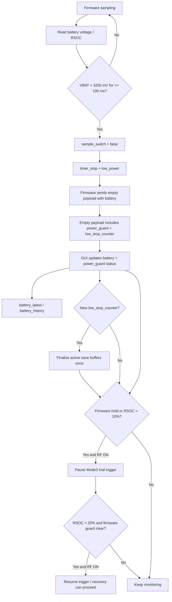

# Firmware 与 GUI 低电保护 / 保存措施总结

Last reviewed: 2026-05-03

## 结论

当前系统已经有两层低电保护：

1. Firmware 以电池电压为硬保护条件，在采样中检测到低压后停止采样、进入低功耗，并阻止低压下重新开始采样。
2. GUI / master console 以电量百分比和状态缓存为软保护条件，保存电池历史、显示低电状态，并在 Protocol 11 / Mode3 trial trigger 场景下暂停行为触发，避免低电时继续触发高功耗记录流程。

本次优化后，Firmware 会在 idle empty payload 中显式上报 `power_guard` 状态和 `low_stop_counter`。GUI 收到新的低电停采计数后，会对当前 active save mode 执行一次 `finalize_save_buffers()`，把未满文件的 pending buffer 主动落盘，同时不关闭 save flag，避免和已有的保存开关、恢复流程互相冲突。

## Firmware 低电保护

### 1. 电池保护阈值

Firmware 中的关键阈值定义在 `Firmware/src/main.c`：

- `BATTERY_LOW_VOLTAGE_MV = 3250`
- `BATTERY_RECOVER_VOLTAGE_MV = 3300`
- `BATTERY_LOW_HOLD_MS = 100`
- `BATTERY_RECOVER_STABLE_MS = 2000`
- `BATTERY_COMM_FAILURE_LIMIT = 3`
- `WATCHDOG_TIMEOUT_MS = 5000`

对应源码位置：

- `Firmware/src/main.c:39`
- `Firmware/src/main.c:40`
- `Firmware/src/main.c:41`
- `Firmware/src/main.c:42`
- `Firmware/src/main.c:43`

### 2. Power guard 状态机

Firmware 使用 `power_guard_state_t` 管理低电状态：

- `POWER_GUARD_NORMAL`: 正常运行。
- `POWER_GUARD_LOW_VBAT_HOLD`: 已进入低电保持状态，停止采样并等待恢复。
- `POWER_GUARD_RECOVERING`: 电压恢复后尝试自动恢复 mode0。
- `POWER_GUARD_REBOOT_PENDING`: 需要冷重启。

源码入口：

- 状态定义：`Firmware/src/main.c:69`
- 状态变量：`Firmware/src/main.c:381`

### 3. 采样中低压停止采样

采样时，Firmware 大约每 10 ms 读取一次 IMU / battery 数据，并调用：

```c
power_guard_refresh_battery(true)
```

当 `battery_mv < 3250 mV` 且持续超过 `100 ms` 时：

- `sample_switch = false`
- `power_guard_state = POWER_GUARD_LOW_VBAT_HOLD`
- 记录日志 `Battery low ... stop sampling`

主循环随后进入 `!sample_switch` 分支：

- `timer_stop()`
- `low_power()`
- `sampling = false`

相关源码：

- 采样中刷新电池：`Firmware/src/main.c:1946`
- 低压确认并停止采样：`Firmware/src/main.c:527`
- 停止采样并进入低功耗：`Firmware/src/main.c:1802`

### 4. 低电时禁止重新开始采样

采样启动前会调用：

```c
sampling_start_allowed()
```

判断规则：

- 当前电压 `< 3250 mV`：直接禁止启动。
- 当前处于 `LOW_VBAT_HOLD` 或 `RECOVERING`：必须 `> 3300 mV` 才允许重新启动。

相关源码：

- `Firmware/src/main.c:621`
- `Firmware/src/main.c:1831`

### 5. 电压恢复后的自动恢复

当系统处于 `LOW_VBAT_HOLD`，并且电压高于 `3300 mV` 且稳定超过 `2000 ms` 后，Firmware 会尝试自动恢复到 mode0：

- `sampe_mode = 0`
- `mode_switch_flag = false`
- `sample_switch = true`
- `power_guard_state = POWER_GUARD_RECOVERING`

如果恢复过程中的 RHD init、filter init、IMU init、timestamp handshake 失败，会取消本次自动恢复，回到低电保持状态，避免反复拉起高功耗采样。

相关源码：

- 自动恢复判断：`Firmware/src/main.c:554`
- 恢复失败取消：`Firmware/src/main.c:495`
- 启动阶段保护：`Firmware/src/main.c:1842`

### 6. 电池计通信异常保护

Firmware 会读取 LC709204F：

- RSOC
- charging / PG status
- cell voltage

如果读取失败，会尝试 `battery_gauge_soft_recover()`：

- 重新初始化 TWI。
- 读取 chip id，要求 `0x001e`。
- 调用 `LC_operate()` 和 `LC_init()`。

连续失败达到 `BATTERY_COMM_FAILURE_LIMIT = 3` 后，进入 `REBOOT_PENDING`，执行冷重启。

相关源码：

- 电池计软恢复：`Firmware/src/main.c:503`
- 电池读取：`Firmware/src/main.c:581`
- 失败计数与重启：`Firmware/src/main.c:601`

### 7. 冷重启前的安全动作

无论是远程重启，还是电池计通信连续失败触发的冷重启，都会走 `perform_pending_reboot()`：

- `sample_switch = false`
- 如果正在采样，先 `timer_stop()`
- 如果 RHD pipeline 已初始化，调用 `low_power()`
- 如果 ESB radio 已初始化，`esb_flush_tx()` / `esb_flush_rx()`
- 喂 watchdog，等待 30 ms
- `sys_reboot(SYS_REBOOT_COLD)`

相关源码：

- `Firmware/src/main.c:455`
- 远程重启入口：`Firmware/src/main.c:478`

### 8. 低功耗动作

`low_power()` 做的主要动作：

- RHD 写入 `Register_config_lowpower`
- 反初始化 RHD SPI
- 禁用 GPPI channels
- 关闭 LSM6DS3 accelerometer / gyroscope

相关源码：

- `Firmware/src/main.c:1049`

### 9. 低电停止后仍会上报空包

当 `sample_switch == false` 时，Firmware 仍会周期性读取电池并发送 `empty_payload_wrap(lc_data)`。这样 GUI 仍可以获得 RSOC / charging status / voltage，用于显示、历史记录和恢复判断。

本次新增了低电保护遥测。正常 idle 仍发送 legacy 5 个 word / 10 bytes empty payload；只有 `power_guard` 非 normal 或带保护 flags 时，empty payload 才临时扩展为 10 个 word / 20 bytes。前 5 个 word 保持 legacy 兼容：

- `0`: payload type `0x0400`
- `1`: empty packet counter
- `2`: RSOC
- `3`: charging / PG status
- `4`: battery voltage mV

新增 word `5..9`：

- `5`: `POWER_GUARD_EMPTY_STATUS_MAGIC = 0x0B01`
- `6`: `power_guard_status_word`
- `7`: `power_guard_low_stop_counter`
- `8`: `power_guard_status_flags`
- `9`: reserved

`power_guard_low_stop_counter` 只在 Firmware 因低电进入 `LOW_VBAT_HOLD` 时递增，用来让 GUI 判断“这是一个新的低电停采事件”，从而只 finalize 一次。

相关源码：

- `Firmware/src/main.c:1819`
- `Firmware/src/main.c:1824`
- `Firmware/ESB_wireless/ESB_wireless.c`

## GUI / Master Console 低电保存与保护

### 1. 电池状态接收与统一状态

Neural reader 会从 firmware payload 中提取 battery triplet，并通过 `StatusUpdate` 发送给 controller：

- `rsoc`
- `reported_rsoc`
- `stat`
- `voltage`
- `power_guard`

SlotService 收到 neural status 后：

- 标准化 `reported_rsoc`
- 更新 `status["battery"]`
- 合并 `status["neural"]["power_guard"]`
- 追加 battery history
- 同步 Mode3 trial trigger gate 状态
- 如果 `power_guard.low_stop_counter` 是新的低电停采事件，触发一次保存 finalize
- 驱动 Protocol 11 recovery 状态机

相关源码：

- neural reader 状态上报：`neural_recorder_GUI/hardware/neural_reader.py:4340`
- SlotService 接收 battery：`neural_recorder_GUI/services/slot_service.py:2219`

### 2. Battery latest 与 history 保存

GUI 对电池数据做两类保存：

#### battery_latest

每次有新电池 snapshot 时，优先写入 lightweight 的 latest cache：

- 默认节流间隔：`battery_latest_flush_ms = 2000`
- 写入 `battery_latest.json`
- 包含 sequence，便于主控台读取最新状态

相关源码：

- `neural_recorder_GUI/services/slot_service.py:2664`
- 默认配置：`neural_recorder_GUI/master_app/runtime_config.py:50`

#### battery_history

历史记录会保留：

- timestamp
- RSOC
- voltage_mv
- battery_stat
- RF status
- 当前 neural mode
- Habits pause 状态

保存策略：

- 24 小时保留窗口。
- 最多 50000 条。
- 相同状态 60 秒内去重。
- 写入 runtime cache 前先标记 dirty。

相关源码：

- 保留常量：`neural_recorder_GUI/services/slot_service.py:75`
- 追加 history：`neural_recorder_GUI/services/slot_service.py:2602`
- 去重逻辑：`neural_recorder_GUI/services/slot_service.py:2625`

### 3. 低电健康状态显示

GUI 中的 battery health 默认用 `20%` 作为 low threshold：

- `rsoc < 20%` -> `low`
- 否则 -> `ok`

这个状态用于主控台显示和 health rollup。

相关源码：

- 阈值：`neural_recorder_GUI/services/health_metrics.py:6`
- health rollup：`neural_recorder_GUI/services/slot_service.py:2789`

### 4. Protocol 11 / Mode3 trial trigger 低电 gate

这是 GUI 中最直接的“低电后保护行为任务与保存链路”的逻辑。

默认阈值：

- pause threshold: `10%`
- resume threshold: `20%`
- policy check interval: `10000 ms`

行为：

- 当 RSOC `< 10%`，SlotService 将 `mode3_trial_trigger_target_paused` 设为 true。
- 当 Firmware 上报 `power_guard.low_battery_hold` 或 `reboot_pending`，也会强制保持 `mode3_trial_trigger_target_paused = true`。
- 当 RF power 确认为 ON 时，向 Habits 发送 pause 命令，进入 protocol 11 free-water pause。
- 这个 pause 会阻止继续触发 Mode3 trial，从而避免低电状态下继续进入高功耗 Mode3 / ESA&MUA 记录流程。
- 当 RSOC `> 20%` 且 RF ON 时，自动 resume trigger。
- 但如果 Firmware 仍处于 low battery hold / reboot pending，即使 RSOC 已经超过 20%，GUI 也不会恢复 trial trigger。
- 如果 RF OFF，则只保持 pending 状态，不强行发送 pause/resume。

相关源码：

- 阈值常量：`neural_recorder_GUI/services/slot_service.py:77`
- target pause/resume 判断：`neural_recorder_GUI/services/slot_service.py:953`
- 发送 pause/resume：`neural_recorder_GUI/services/slot_service.py:979`
- 10 秒 policy check：`neural_recorder_GUI/services/slot_service.py:1052`

### 5. Protocol 11 低电/重启后的恢复保护

当 Protocol 11 中 neural sampling 异常变成 idle，且不是手动 stop 时，`Protocol11RecoveryCoordinator` 会进入 recovery：

1. 先进入 `waiting_battery`。
2. 只有 RSOC `> 20%` 才继续。
3. 设置 IMU accel。
4. RF off。
5. 暂停 Habits。
6. 切到 mode1 做 auto threshold。
7. 切回 mode0 采样。
8. 退出 protocol 11 free-water pause。
9. 恢复 Habits。

这个机制避免低电重启后 GUI 立刻重新拉起高功耗采样。

相关源码：

- 等待电量恢复：`neural_recorder_GUI/services/protocol11_recovery.py:110`
- 恢复流程：`neural_recorder_GUI/services/protocol11_recovery.py:115`
- 触发日志：`neural_recorder_GUI/services/protocol11_recovery.py:151`

### 6. EDF 保存链路的保护

GUI 的 neural 数据写盘使用后台 save process 和队列，不在 serial read / decode 主线程里直接写 EDF：

- 采集线程把数据打包成 chunk。
- `_save_put()` 将任务送入 `multiprocessing.Queue`。
- save process 负责写 EDF。
- 主控台会记录 `save_enqueue_ms`、`writer_lag`、`save_queue_drop_count`，用于判断保存是否跟不上。

相关源码：

- save process：`neural_recorder_GUI/hardware/neural_reader.py:65`
- save queue enqueue：`neural_recorder_GUI/hardware/neural_reader.py:2449`
- save telemetry：`neural_recorder_GUI/hardware/neural_reader.py:4340`
- save overload log：`neural_recorder_GUI/services/slot_service.py:2276`

### 7. 未满文件的强制 flush / finalize

GUI 已有多个 finalize 路径，避免已经在内存里的数据因为未达到固定文件长度而丢失：

- 切换 save mode 或关闭某个 save mode 时，会 finalize 旧 mode 的 buffer。
- 关闭 global save 时，会 finalize 当前 active save mode。
- serial port close / stop 时，会调用 `finalize_save_buffers()`。
- `finalize_save_buffers()` 会对 lfp / mode1 / mode2 / mode3 的 pending 数据执行 `manual_save=True`。
- 新增：Firmware 低电停采事件到达时，SlotService 会根据 `save_flags` / `save_mode` 对当前 active save mode 执行一次 `finalize_save_buffers()`，并写 system log。
- 低电 finalize 不会自动关闭 save flag。这样做的目的，是让“保存开关状态”仍由原有 GUI 控件和恢复流程管理，低电保护只负责把已经在内存里的数据先落盘。

相关源码：

- save mode 切换 finalize：`neural_recorder_GUI/services/controllers.py:1408`
- global save off finalize：`neural_recorder_GUI/services/controllers.py:1464`
- serial close finalize：`neural_recorder_GUI/hardware/neural_reader.py:2413`
- manual finalize：`neural_recorder_GUI/hardware/neural_reader.py:4987`
- data saving control 中的 manual save 路径：`neural_recorder_GUI/hardware/neural_reader.py:5369`

### 8. Runtime cache 保存策略

SlotService 会周期性 flush runtime cache：

- status cache 默认每 `1000 ms`
- history cache 默认每 `5000 ms`
- 每个 tick 默认最多写 `2` 个 history 任务
- 默认在 sampling 时延迟写 battery_history / habits history 这类大 history，避免影响采集
- 但是 `battery_latest` 仍然会按节流间隔写入，用于主控台实时显示
- shutdown 时会强制 flush battery history 和 habits history

相关源码：

- 默认配置：`neural_recorder_GUI/master_app/runtime_config.py:47`
- history defer：`neural_recorder_GUI/services/slot_service.py:4408`
- history flush：`neural_recorder_GUI/services/slot_service.py:4416`
- shutdown force flush：`neural_recorder_GUI/services/slot_service.py:4614`

## 低电事件的整体流程



## 当前边界与建议

### 已经比较稳的部分

- Firmware 的低电停采样是硬保护，直接基于电压阈值，不依赖 GUI。
- Firmware 在低电后进入 `low_power()`，会关闭 RHD/IMU 相关高功耗部分。
- 低电时 Firmware 仍发送 empty payload，GUI 可以继续记录和显示电池状态，并解析 `power_guard` 低电停采事件。
- GUI 会保存 `battery_latest` 和 `battery_history`，并且有去重、节流、runtime cache 原子写入和 shutdown force flush。
- Protocol 11 场景下，GUI 会暂停 Mode3 trial trigger，避免低电继续触发高功耗 Mode3 记录。
- GUI 收到新的 Firmware 低电停采事件后，会主动 finalize 当前 active save buffers，一次事件只执行一次。

### 需要注意的边界

- GUI 的低电 finalize 依赖低电后的 empty payload 能到达上位机。如果设备在发出 empty payload 前彻底掉电，仍只能依赖进程已有的队列/文件系统状态。
- 低电 finalize 只主动落盘 pending buffer，不自动执行 `set_save_mode(..., False)`。这是为了避免低电保护和用户/Protocol 11 recovery 的保存开关状态互相抢控制权。
- `battery_history` 在 sampling 时默认会被延迟写入，以降低采集负载；实时状态主要靠 `battery_latest`。
- 如果低电后上位机或系统直接断电，未写入 save process 或操作系统缓存的数据仍有风险。

### 后续可选优化

1. 在主控台增加更醒目的 `Firmware Power Guard` tile，直接显示 `normal / low_vbat_hold / recovering / reboot_pending`。
2. 如果实测发现低电后仍可能继续采样，可以让 GUI 在收到低电停采事件后可选地自动关闭 save flag 或发 stop 命令。
3. 对低电 finalize 的输出文件记录增加单独 audit 字段，例如 `finalize_reason = firmware_low_battery_stop`。
4. 后续硬件测试中确认 empty payload 的 10-word 格式在接收器/串口桥上稳定透传。
