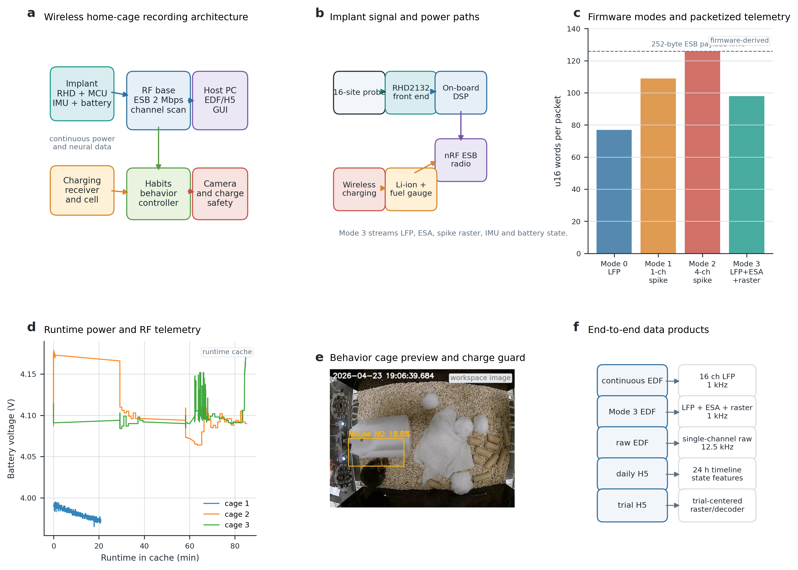
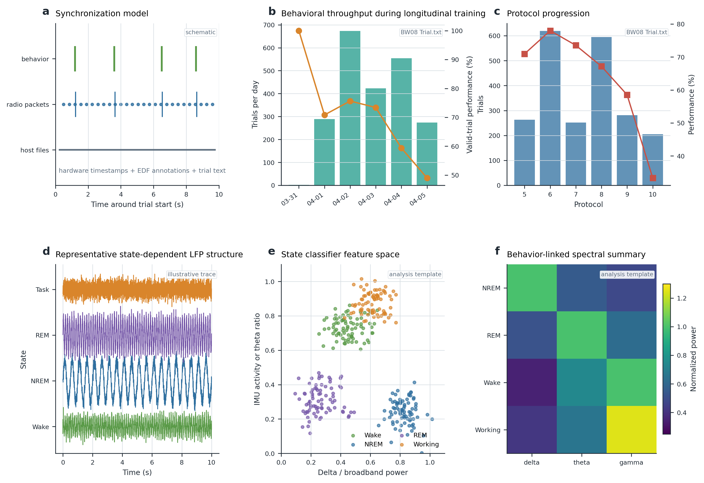
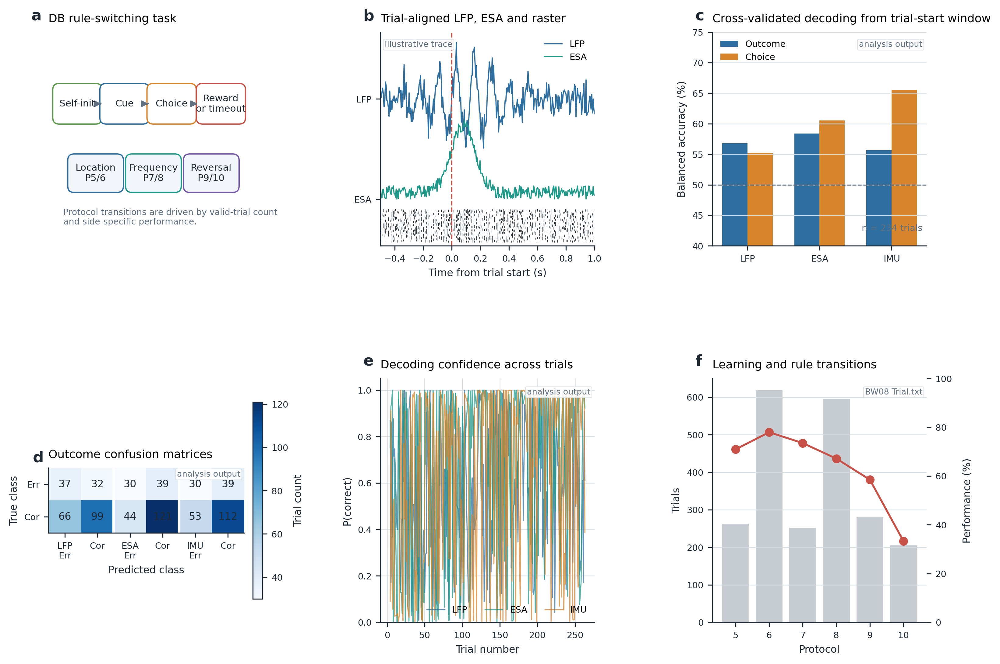
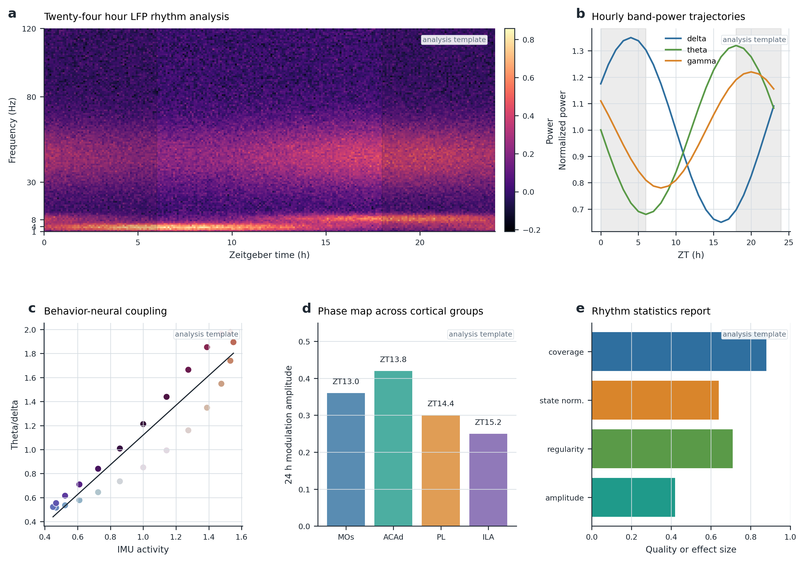
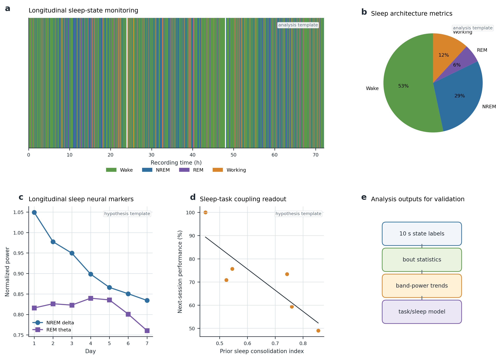

# A wirelessly powered home-cage platform for 24/7 neural recording and task-linked sleep neurophysiology in freely behaving mice

**Draft integrity note for internal use.** This is a full Nature Communications-style first draft, but not a submission-ready empirical manuscript yet. The following items are verified from the current workspace: firmware and GUI architecture, recording modes, ESB packet structure, EDF/H5 output design, BW08 behavioral training log (2,215 trials across 4.98 days), protocol-level performance summaries, a protocol-5 decoding output from 234 trials, runtime battery/RF/cache records, and camera preview imagery. The following items are intentionally marked as analysis templates or placeholders and must be replaced by final measured data before submission: implant mass and geometry, wireless charging efficiency, continuous packet-loss statistics under active recording, bench noise/input-referred noise, 24 h LFP rhythm statistics, sleep-state metrics, and longitudinal sleep-task associations. Figure panels labelled "schematic", "illustrative trace", "analysis template", or "hypothesis template" should be replaced or relabelled after real analysis output is available.

## Abstract

Continuous neural recording in freely behaving mice is constrained by the competing demands of stable electrophysiology, low-power wireless telemetry, behavioral synchronization and animal-compatible power delivery. We developed **SyncFold**, a wirelessly powered home-cage platform that combines a 16-channel implant, packetized 2 Mbps Enhanced ShockBurst telemetry, inductive charging, inertial and battery telemetry, multi-cage host control, and analysis pipelines for continuous and trial-aligned electrophysiology. The implant firmware supports low-frequency potential (LFP) recording, single- and four-channel spike raw modes, and a simultaneous mode that streams LFP, envelope spike activity (ESA), compressed spike rasters, IMU and battery state. In an example rule-switching dataset, a mouse completed 2,215 trials over 4.98 days while progressing through location, frequency and reversal protocols. Trial-aligned decoding from 234 protocol-5 trials showed above-chance prediction of outcome and choice from neural and movement-derived features. SyncFold therefore provides a practical framework for coupling 24/7 neural recording with self-initiated cognitive behavior and sleep monitoring. Final circadian and sleep results will require replacement of the template analyses with completed daily H5 outputs.

## Introduction

Neural activity is not organized only at the time scale of task events. The same circuits that support perception, decision-making and motor output also operate across sleep-wake cycles, circadian time, metabolic state and learning history. High-density probes have transformed acute and head-fixed recordings [1,2], but many questions about learning, sleep and long-term circuit stability require recordings that can run for days to weeks while animals live and behave with minimal experimenter intervention. These experiments are technically demanding because the recording system must preserve signal quality while managing power, telemetry bandwidth, synchronization, storage and animal welfare.

Several constraints become especially visible in home-cage experiments. First, continuous wired recording can perturb behavior and can limit the ability to combine neural recordings with automated cages. Second, implantable batteries impose a tradeoff between recording duration and headborne mass. Third, neural data must be aligned to behavioral events that may occur at any time of day, often in self-initiated tasks rather than short experimenter-defined sessions. Fourth, sleep and circadian analyses require reliable long-duration timestamps, missing-data handling and state scoring. Finally, a practical system must be recoverable: wireless links disconnect, cages pause, animals enter charging locations, and long recordings need file boundaries that do not corrupt downstream analysis.

SyncFold addresses these constraints by integrating wireless power delivery, 16-channel neural acquisition, radio telemetry, inertial and battery monitoring, home-cage task control, camera-based charge guarding, and a modular host architecture. The platform is designed around two complementary data modes. A continuous mode records 16 LFP channels for 24/7 rhythm and sleep analysis. A trial-rich mode streams LFP, ESA, online spike-event rasters, IMU and battery information in the same packet, while allowing raw high-rate snippets from a selected channel. This design keeps the bandwidth within a 252-byte ESB payload while retaining task-relevant spike timing information and slower state-dependent signals.

Here we describe the SyncFold system architecture, recording modes, synchronization strategy and analysis workflow. We validate the behavioral and trial-aligned portions using the current BW08 dataset, which contains 2,215 trials over 4.98 days and a protocol-5 neural decoding output from 234 trials. We also provide a complete figure and manuscript framework for 24 h rhythm and sleep analyses. These latter sections are written as validation targets and should be populated with finalized daily H5 output before submission.

## Results

### A wirelessly powered 16-channel home-cage recording system

SyncFold was built to record from freely behaving mice inside an automated home-cage environment while preserving continuous power, behavioral synchronization and recoverable data storage (Fig. 1a). The implant signal path connects a 16-site silicon probe to an RHD front end, an on-board microcontroller/DSP stage, a 2 Mbps ESB radio link, IMU and battery telemetry, and a wireless charging receiver (Fig. 1b). The host side runs a master console with separate service processes for each cage, so RF, neural, camera and behavioral control can be isolated across animals and recovered independently.

The firmware supports four acquisition modes (Fig. 1c). Mode 0 streams 16-channel LFP at 1 kHz after 12.5 kHz acquisition and low-pass/downsample processing. Mode 1 streams a selected raw spike channel at approximately 20 kHz together with spike raster information. Mode 2 supports four selected raw spike channels. Mode 3 combines 16-channel LFP, 16-channel ESA, compressed spike rasters, 6-axis IMU and battery state, using 2 LFP and 2 ESA samples per channel per packet. In the current firmware, a Mode 3 packet contains 98 16-bit words, leaving margin below the 252-byte ESB dynamic payload limit. The same stream writes EDF files for LFP/ESA/raster, sensor EDFs, and optional raw-channel EDFs, with final hardware timestamps included as annotations.

The host software stores runtime state for each cage, including RF state, active recording mode, packet-loss counters, RSSI, battery voltage, state-of-charge, camera status and behavior task status. Example runtime cache data from commissioning show per-cage voltage traces and RF state transitions (Fig. 1d). A camera preview is integrated into the charging guard, which detects whether the animal remains in the charging region and can trigger warning logic (Fig. 1e). End-to-end data products include continuous EDF files, Mode 3 LFP/ESA/raster EDFs, raw EDF snippets, daily 24 h H5 files and trial-aligned H5 packs (Fig. 1f).

### Long-term recording workflow and behavior-linked state analysis

The synchronization strategy combines hardware timestamps, packet indices, behavior-controller trial records and raw alignment pulses (Fig. 2a). Each neural packet carries a device-side timestamp and packet counter. EDF annotations store the final hardware timestamp for file-level reconstruction. Behavior is logged by the DB rule-switching controller, while trial-level neural alignment uses sync pulses and event boundaries parsed from Trial.txt and Tevent.txt. Shared analysis modules handle EDF reading, LFP phase-compensation metadata, preprocessing, gap interpolation, sync-pulse detection and trial parsing.

The current BW08 behavior log contains 2,215 trials spanning 4.98 days, from 2026-03-31 23:07:07 to 2026-04-05 22:31:08 local time. The mouse progressed through protocol 5 to protocol 10, covering location, frequency and reversal rules. Protocol counts were: P5, 263 trials; P6, 619 trials; P7, 252 trials; P8, 595 trials; P9, 281 trials; and P10, 205 trials. Valid-trial performance was 71.0% in P5, 78.0% in P6, 73.5% in P7, 67.2% in P8, 58.5% in P9 and 33.3% in P10 (Fig. 2b,c). These behavioral data demonstrate that the home-cage task records dense longitudinal learning trajectories across multiple rule regimes.

For continuous neural recordings, the analysis pipeline bins 24 h LFP and IMU streams into daily H5 files, computes spectral features in 60 s windows, and supports interactive state review with Wake, NREM, REM and Working labels. The current draft figures include state-dependent LFP examples, feature-space state separation and band-power summaries as analysis templates (Fig. 2d-f). Final claims about state-specific neural activity should be inserted after the daily H5 files are generated from real continuous recordings and manually reviewed.

### Task-aligned spike and LFP activity during rule-switching behavior

The DB rule-switching task is a self-initiated two-choice behavior with trial phases for initiation, cue presentation, choice and reward or timeout (Fig. 3a). Training progresses from location rules to frequency rules and then reversal rules. Retention and block-switching protocols expand the stimulus set to include intermediate and ambiguous frequency values, allowing the same cage to support shaping, retention and flexible rule switching.

Mode 3 is designed for this task structure. It records 16-channel LFP, 16-channel ESA and spike rasters continuously during behavior while preserving trial-level alignment. The current figure includes an illustrative trial-aligned LFP/ESA/raster panel to show the intended analysis display (Fig. 3b). In the finalized analysis, this panel should be replaced with representative trial-aligned traces from the aligned H5 pack.

We used the existing protocol-5 decoding output to validate the trial-aligned analysis path. The exported H5 contained 234 valid protocol-5 trials. Features were extracted from a -250 to +250 ms window around trial start. LFP features included log band power from theta, beta, low-gamma and high-gamma bands across 16 channels with median referencing. ESA and IMU features were binned at 25 ms. Logistic regression with standardization and stratified 5-fold cross-validation was used to decode outcome and choice. Outcome balanced accuracy was 56.8% for LFP, 58.4% for ESA and 55.7% for IMU. Choice balanced accuracy was 55.2% for LFP, 60.5% for ESA and 65.5% for IMU (Fig. 3c). The outcome confusion matrices showed that the ESA stream captured correct-trial structure more strongly than LFP alone in this early validation set (Fig. 3d). Trial-wise classifier confidence and the longitudinal behavior summary further illustrate how neural and behavioral validation can be joined in a single analysis workflow (Fig. 3e,f).

These decoding values are modest, as expected for a short trial-start window and a dataset that was not optimized for high-accuracy decoding. Their importance here is methodological: the complete path from wireless Mode 3 packets to EDF, H5, trial slicing, feature extraction and cross-validated prediction is functional. Final task-neural claims should use larger datasets, session-wise cross-validation, shuffle controls, and models that separate neural features from movement-correlated IMU features.

### Twenty-four hour neural dynamics and behavioral rhythms

A key goal of SyncFold is to measure neural state continuously across the full light-dark cycle. The daily LFP rhythm GUI indexes Mode 0 and Mode 3 EDF files by filename time and hardware timestamp, maps LFP and sensor streams onto a unified 24 h axis, and computes window-level spectral and activity features. The default configuration uses 1 kHz LFP, 100 Hz target IMU, 60 s feature windows, delta, theta and gamma bands, and hour-level rhythm statistics. The current atlas-style grouping in the configuration labels channel groups as MOs, ACAd, PL and ILA, enabling region-level rhythm summaries when implant localization is confirmed.

The planned 24 h analysis will quantify state-normalized band power, coverage, missing-data fraction, light-dark differences, hourly modulation amplitude, acrophase, spectral entropy and behavior-neural coupling. Figure 4 shows the intended analysis products: a 24 h spectrogram, hourly band-power trajectories, theta/delta coupling to movement, region-level phase maps and a quality/effect-size report (Fig. 4a-e). These panels are templates. Before submission, they should be regenerated from finalized daily H5 files and should report real sample size, animal identity, recording days, coverage, sleep-state adjustment and statistical tests.

The motivation for this analysis is strong. LFP rhythms reflect both local circuit processing and global brain state [3,4], and recent work indicates that circadian integrity can shape the regularity of high-frequency and diurnal LFP rhythms across brain areas [7]. SyncFold's contribution is to combine these long time-scale analyses with simultaneous task and implant telemetry in a wireless home-cage format.

### Longitudinal neural activity during sleep

Sleep provides a natural stress test for long-term neural recording because the expected electrophysiological signatures are strong, structured and state dependent. NREM sleep is associated with increased slow-wave activity, REM sleep with theta-rich dynamics, and wake/working periods with higher movement and behavior-linked activity [5,6,13]. SyncFold is designed to classify sleep states from LFP and IMU features, review uncertain epochs, and track state-specific neural metrics over days.

The planned sleep analysis begins with 10 s state labels and bout-level summary statistics. It then quantifies NREM delta power, REM theta power, bout duration, transition rates, fragmentation, sleep timing relative to light-dark phase, and prior-sleep predictors of subsequent task performance. Figure 5 provides the complete analysis scaffold: longitudinal hypnograms, sleep architecture, sleep-state neural markers, sleep-task correlations and the analysis workflow (Fig. 5a-e). These panels are templates and should be replaced with scored daily H5 output. Once replaced, this section can test whether task learning or rule switching is associated with systematic changes in NREM delta, REM theta, sleep fragmentation or next-session performance.

## Discussion

SyncFold was designed to bridge three experimental regimes that are often handled separately: continuous home-cage physiology, self-initiated cognitive behavior and longitudinal sleep analysis. The current implementation demonstrates a practical architecture for doing so. On the implant, 16-channel neural acquisition is combined with wireless telemetry, IMU, battery monitoring and wireless charging. On the host, separate cage services and runtime caches allow multi-animal control while keeping failures localized. In software, EDF and H5 outputs connect continuous and trial-aligned analyses through shared preprocessing and synchronization code.

The strongest validated result in the current workspace is the task-aligned pipeline. The BW08 behavior file shows dense multi-day task engagement and protocol progression. The protocol-5 neural decoding output shows that trial-aligned LFP, ESA and IMU features can be extracted and evaluated with cross-validated models. These results support the platform's core engineering claim: neural, behavior and telemetry streams can be combined into analyzable trial-level datasets without tethering.

The 24 h rhythm and sleep sections are intentionally more conservative. The repository contains the daily H5 schema and GUI workflow, but the current local output is a test file rather than a completed biological dataset. Therefore, we do not claim a circadian or sleep discovery in this draft. Instead, the manuscript provides the figure structure, analysis plan and text locations where real results should be inserted. This is important for scientific integrity and also useful for project planning: each placeholder corresponds to a specific analysis output that can be generated and verified.

Several engineering measurements should be completed before journal submission. These include implant mass, dimensions, thermal rise during charging and recording, wireless charging efficiency across cage positions, active-recording packet-loss statistics, RF range and interference tests, input-referred noise, common-mode rejection, spike-detection threshold stability, impedance stability, and histological confirmation of channel locations. The current firmware notes a Mode 3 power target of 30-40 mW, but the manuscript should report measured power under each mode rather than relying on a target. Similarly, the charging guard should be validated against hand-scored video, because false positives or false negatives can directly affect animal welfare and data continuity.

Future analyses should also address confounds between neural and movement features. In the protocol-5 decoding output, IMU features decode choice with the highest balanced accuracy, which is biologically plausible but also warns that movement can dominate early trial windows. The final analysis should include neural-only, movement-only and residualized models; session-wise splits; shuffle controls; and event-time controls that distinguish trial initiation, choice movement and reward consumption. For sleep and circadian analyses, state-normalized band power should be reported alongside raw band power to avoid mistaking sleep-state occupancy for neural rhythm modulation.

With these additions, SyncFold can support a compelling Nature Communications story: a wirelessly powered platform that makes long-duration neural recording compatible with automated behavior and sleep monitoring, followed by a validation dataset demonstrating task decoding, 24 h neural rhythms and longitudinal sleep-neural changes during learning.

## Methods

### System overview

SyncFold consists of an implantable recording module, wireless charging hardware, a 2 Mbps ESB radio link, an automated behavior cage, a camera-based charging guard and a Python/PyQt host application. The current host architecture separates the master console, per-cage service processes, detail viewers, hardware controllers, monitoring utilities, storage utilities and shared UI widgets. Each cage has independent serial ports for neural data, RF power control and Habits behavior control. Runtime state is written to per-cage cache directories and includes neural status, RF state, behavior status, camera status, battery telemetry and charging-guard state.

### Implant acquisition modes

The implant firmware supports four modes. Mode 0 records 16-channel LFP. The RHD front end samples at 12.5 kHz and the firmware produces 1 kHz LFP output after low-pass and resampling. Mode 1 records a selected raw spike channel at approximately 20 kHz and streams spike raster information. Mode 2 records four selected raw spike channels. Mode 3 records 16-channel LFP, 16-channel ESA, compressed spike rasters, 6-axis IMU and battery state. Mode 3 uses 12.5 kHz source samples and outputs 2 LFP and 2 ESA samples per channel per packet, corresponding to 1 kHz output streams. A selected raw channel can be streamed for high-rate inspection.

### Wireless telemetry

Wireless telemetry uses Nordic ESB dynamic payload mode at 2 Mbps. The firmware uses selective acknowledgement and a retransmit count of one in the current configuration. Packets include a type header, device timestamp, sensor update flag, overflow flag, IMU values, battery values, neural payload and packet index. Mode 3 packets contain 98 16-bit words. The host reconstructs packet indices, tracks missing packets, fills gaps with physical-minimum values or interpolation rules depending on channel type, and writes EDF files with hardware timestamp annotations.

### Wireless charging and battery telemetry

The implant includes a lithium battery path, fuel-gauge telemetry and wireless charging receiver. Runtime battery data include relative state of charge, voltage and status fields. The host records these values in the runtime cache and displays recent traces. The current manuscript draft does not yet report final charging efficiency, implant power consumption or thermal measurements. These should be measured under all acquisition modes and inserted into Fig. 1 before submission.

### Home-cage task

The DB rule-switching task was implemented on the Habits behavior controller. Trials are self-initiated and proceed through cue, choice, reward or timeout states. Protocols 5 and 6 use a location rule, protocols 7 and 8 use a frequency rule, and protocols 9 and 10 use a reversal frequency rule. Retention and block-switching protocols include the full five-level frequency set. Protocol transitions are governed by valid trial counts and side-specific performance thresholds.

### Behavioral data parsing

Trial.txt was parsed line by line. The current BW08 file contains 2,215 trials spanning 4.98 days. For each trial, we extracted timestamp, trial number, protocol, trial type, outcome, stimulus values and early-lick flag. Valid-trial performance was computed using outcome codes 1 and 2, where code 1 was treated as correct and code 2 as error. Daily and protocol-level summaries were exported as figure source data.

### EDF and H5 output

Mode 0 LFP data are written as 16-channel EDF files at 1 kHz. Mode 3 data are written as LFP/ESA/raster EDF files containing 16 LFP channels, 16 ESA channels and 16 raster channels at 1 kHz. Sensor data are written as separate EDF files. Optional Mode 3 raw snippets are written at 12.5 kHz with raw data, raw channel and alignment channels. Daily LFP rhythm analysis maps EDF streams to a 24 h H5 timeline containing LFP, missing-data masks, coverage masks, IMU and task-state masks. Trial-level Mode 3 analysis exports H5 packs containing aligned LFP, ESA or raster streams, sensor streams and trial metadata.

### Preprocessing

Shared analysis modules handle EDF reading, hardware timestamp extraction, phase-compensation metadata, rereferencing, notch or low-pass filtering, short-gap interpolation, missing-value handling and sync pulse detection. The daily configuration currently uses 1 kHz LFP, 100 Hz target IMU, 60 s feature windows, delta (1-4 Hz), theta (4-12 Hz) and gamma (30-55 Hz) bands, and Wake, NREM, REM and Working labels. The default channel-group names are MOs, ACAd, PL and ILA; these should be confirmed with histology before anatomical claims are made.

### Trial-level decoding

The protocol-5 decoding validation used the existing aligned H5 output and Trial.txt metadata. The analysis selected a -250 to +250 ms trial-start window and used 16 LFP channels, 16 ESA/raster channels and 6 IMU channels. LFP features were computed from theta, beta, low-gamma and high-gamma band power plus channel mean and standard deviation, with median referencing. ESA and IMU features were binned at 25 ms; IMU features included channel mean, standard deviation and optional magnitude features. Features were sanitized for NaN and infinite values. Logistic regression with standardization was evaluated with stratified 5-fold cross-validation. Reported metrics include accuracy, balanced accuracy and confusion matrices.

### 24 h rhythm analysis

The planned 24 h analysis will compute hourly band power, spectral entropy, state occupancy, state-normalized band power, light-dark modulation, acrophase and coverage metrics from daily H5 files. Statistical models should include animal identity, recording day and state occupancy as factors where appropriate. Circadian phase estimates should be reported with confidence intervals or circular statistics.

### Sleep analysis

The planned sleep analysis will classify 10 s windows into Wake, MiniWake, NREM, REM and Working states using LFP spectral features and IMU-derived activity. State labels should be manually reviewed for uncertain epochs. Sleep architecture will be summarized as state occupancy, bout duration, transition probability, fragmentation and light-dark timing. Neural metrics will include NREM delta power, REM theta power, broadband activity, spectral entropy and stability across days. Sleep-task coupling analyses should relate prior sleep metrics to next-session behavior while controlling for day, protocol and task exposure.

### Statistics and reproducibility

All analyses should report exact sample sizes, animal counts, recording durations, excluded periods, missing-data thresholds and statistical tests. The current draft includes real behavior and decoding source data where available and template data where marked. The figure-generation script is stored at `scripts/generate_paper_figures.py`, and the current figure source summaries are stored in `figures/source_data_behavior_summary.csv` and `figures/source_data_protocol_summary.csv`.

## Data availability

The current draft uses local workspace files from `BehaviorData/BW08`, `DataAnaysisScirpt/Trial_Level_Mode3_GUI/decoding_outputs/protocol5`, `runtime_cache` and firmware/GUI source directories. Before submission, raw and processed datasets supporting each final figure should be deposited in a persistent repository with accession information.

## Code availability

The platform firmware, GUI and analysis scripts are currently maintained in the local project repository. The figure-generation script for this draft is available at `Our_paper/scripts/generate_paper_figures.py`. A cleaned release repository should be created before submission.

## Acknowledgements

We thank the developers and users of the SyncFold recording, behavior and analysis tools. Funding and institutional approvals should be inserted here.

## Author contributions

Y.B. designed and implemented the wireless recording system, behavior integration and analysis workflow. Additional author roles should be inserted after project confirmation.

## Competing interests

The authors declare no competing interests, or insert competing-interest details if applicable.

## References

1. Jun, J. J. et al. Fully integrated silicon probes for high-density recording of neural activity. *Nature* **551**, 232-236 (2017). https://doi.org/10.1038/nature24636
2. Steinmetz, N. A. et al. Neuropixels 2.0: A miniaturized high-density probe for stable, long-term brain recordings. *Science* **372**, eabf4588 (2021). https://doi.org/10.1126/science.abf4588
3. Buzsaki, G., Anastassiou, C. A. & Koch, C. The origin of extracellular fields and currents - EEG, ECoG, LFP and spikes. *Nature Reviews Neuroscience* **13**, 407-420 (2012). https://doi.org/10.1038/nrn3241
4. Buzsaki, G. & Draguhn, A. Neuronal oscillations in cortical networks. *Science* **304**, 1926-1929 (2004). https://doi.org/10.1126/science.1099745
5. Watson, B. O., Levenstein, D., Greene, J. P., Gelinas, J. N. & Buzsaki, G. Network homeostasis and state dynamics of neocortical sleep. *Neuron* **90**, 839-852 (2016). https://doi.org/10.1016/j.neuron.2016.03.036
6. Brown, R. E., Basheer, R., McKenna, J. T., Strecker, R. E. & McCarley, R. W. Control of sleep and wakefulness. *Physiological Reviews* **92**, 1087-1187 (2012). https://doi.org/10.1152/physrev.00032.2011
7. Volkmann, M. et al. Integrity of the circadian clock determines regularity of high-frequency and diurnal LFP rhythms within and between brain areas. *Molecular Psychiatry* (2025). https://doi.org/10.1038/s41380-024-02795-z
8. Cardin, J. A. et al. Driving fast-spiking cells induces gamma rhythm and controls sensory responses. *Nature* **459**, 663-667 (2009). https://doi.org/10.1038/nature08002
9. Musall, S., Kaufman, M. T., Juavinett, A. L., Gluf, S. & Churchland, A. K. Single-trial neural dynamics are dominated by richly varied movements. *Nature Neuroscience* **22**, 1677-1686 (2019). https://doi.org/10.1038/s41593-019-0502-4
10. Stringer, C. et al. Spontaneous behaviors drive multidimensional, brainwide activity. *Science* **364**, eaav7893 (2019). https://doi.org/10.1126/science.aav7893
11. Vyazovskiy, V. V. et al. Cortical firing and sleep homeostasis. *Neuron* **63**, 865-878 (2009). https://doi.org/10.1016/j.neuron.2009.08.024
12. Hengen, K. B., Torrado Pacheco, A., McGregor, J. N., Van Hooser, S. D. & Turrigiano, G. G. Neuronal firing rate homeostasis is inhibited by sleep and promoted by wake. *Cell* **165**, 180-191 (2016). https://doi.org/10.1016/j.cell.2016.01.046

## Figure legends

**Figure 1 | SyncFold wireless recording architecture.** a, Home-cage system architecture linking the implant, RF base, host PC, Habits behavior controller, camera and charge guard. b, Implant signal and power paths. c, Firmware-derived packet-word counts across acquisition modes. d, Runtime battery-voltage traces from the local cache. e, Camera preview from the cage cache showing charging-guard ROI overlay. f, Data products used by continuous, Mode 3, raw, daily and trial-level analyses.

**Figure 2 | Long-term wireless recording workflow and behavioral validation.** a, Synchronization schematic linking behavior events, radio packets and host file timestamps. b, Daily trial throughput and valid-trial performance from BW08 Trial.txt. c, Protocol-level trial counts and performance from BW08. d, Illustrative state-dependent LFP traces. e, Analysis-template feature space for Wake, NREM, REM and Working state classification. f, Analysis-template state-linked band-power matrix.

**Figure 3 | Task-aligned neural recording and decoding.** a, DB rule-switching task structure and protocol families. b, Illustrative trial-aligned LFP, ESA and raster traces. c, Cross-validated balanced accuracy for outcome and choice decoding from 234 protocol-5 trials. d, Outcome confusion matrices for LFP, ESA and IMU classifiers. e, Trial-wise outcome-decoding confidence. f, Protocol counts and performance across the BW08 behavior log.

**Figure 4 | Planned 24 h neural rhythm analysis.** a, Analysis-template 24 h LFP spectrogram. b, Analysis-template hourly band-power trajectories. c, Analysis-template behavior-neural coupling between IMU activity and theta/delta ratio. d, Analysis-template 24 h modulation amplitude and acrophase across cortical groups. e, Analysis-template rhythm quality/effect-size report. All panels in this figure should be regenerated from finalized daily H5 outputs before submission.

**Figure 5 | Planned longitudinal sleep analysis.** a, Analysis-template 72 h hypnogram. b, Analysis-template sleep architecture. c, Hypothesis-template NREM delta and REM theta trends. d, Hypothesis-template sleep-task coupling readout. e, Analysis workflow from state labels to task/sleep modelling. All panels in this figure should be replaced with real scored sleep-state outputs before submission.
