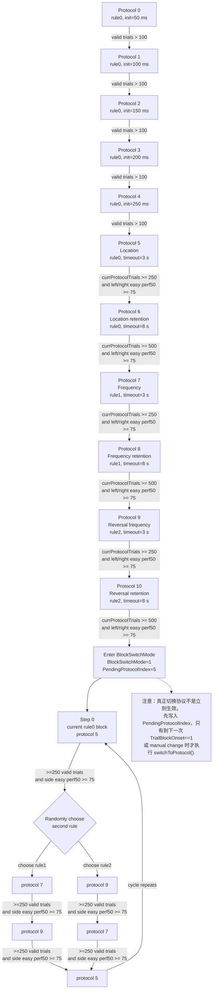
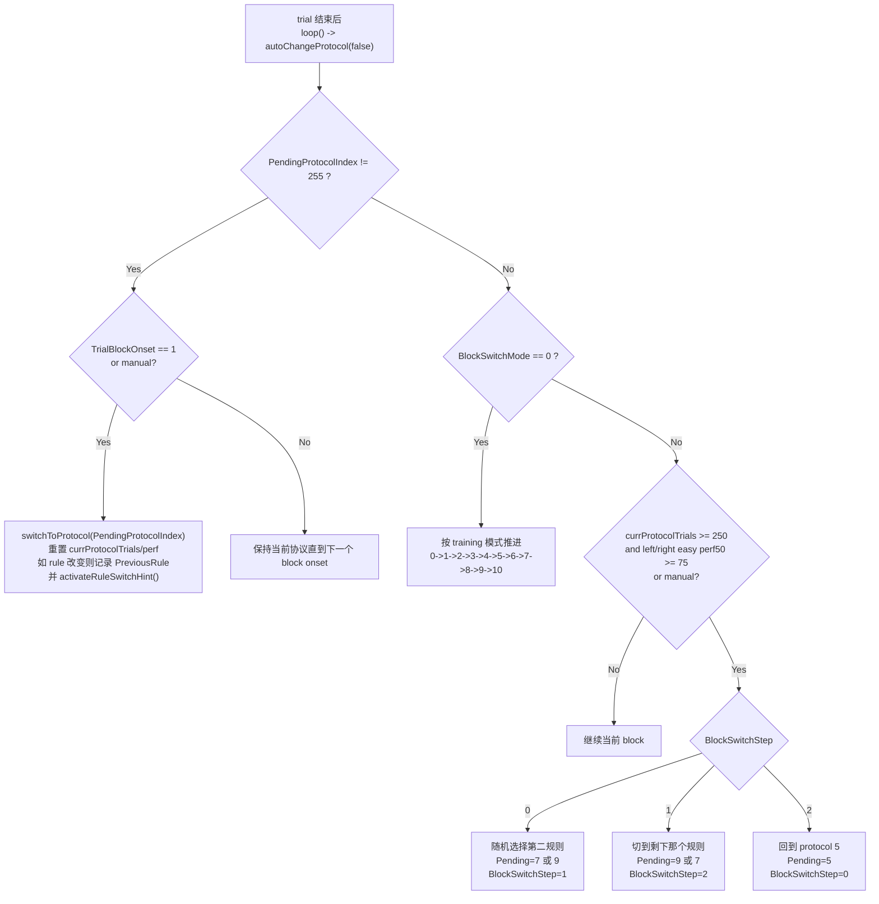
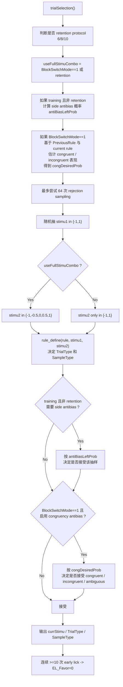
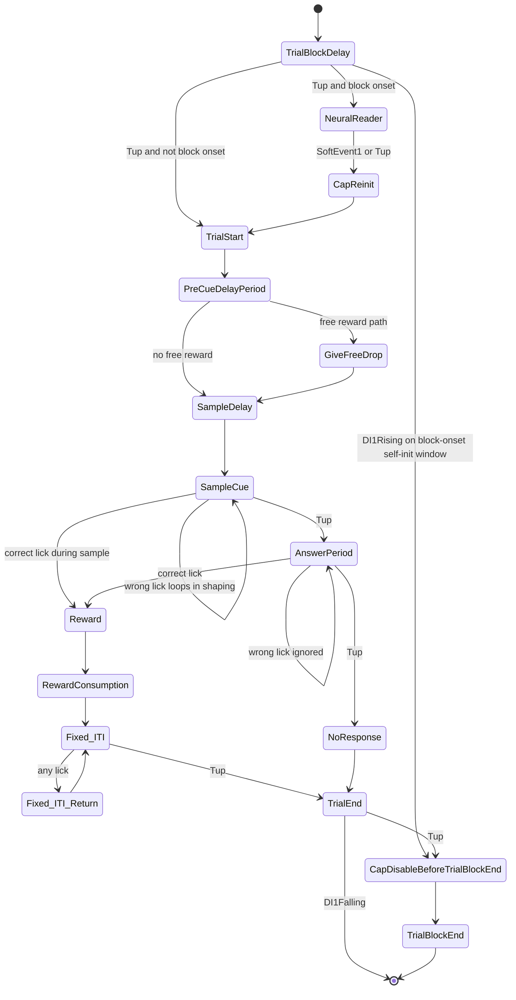
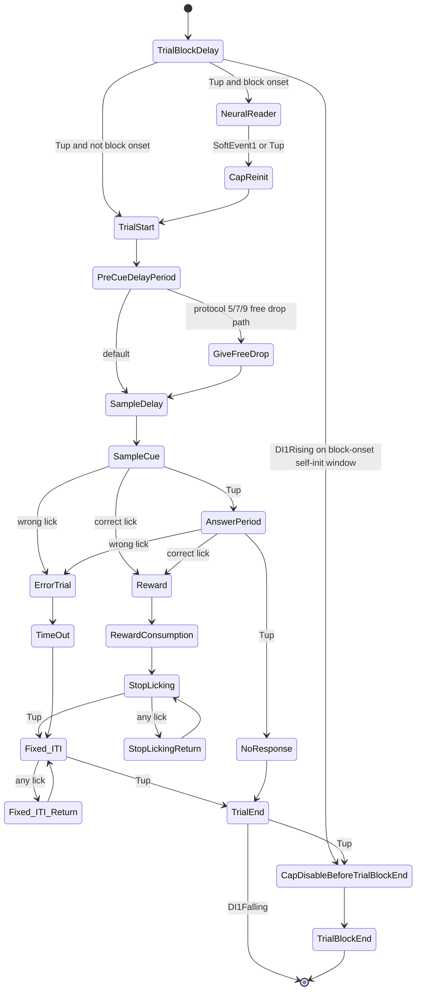
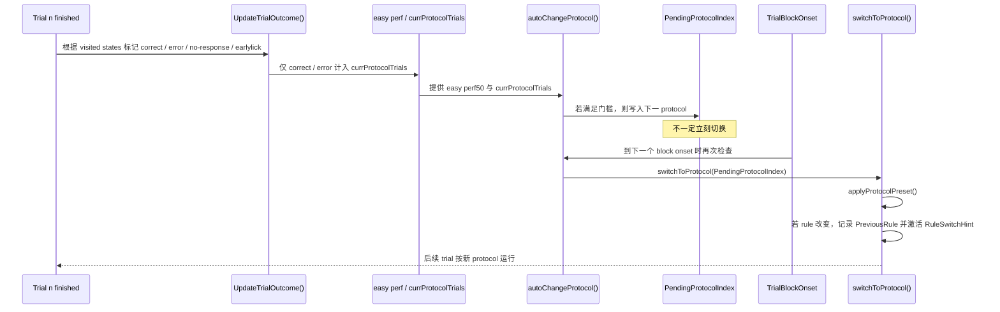

# DBRuleSwitch.ino 范式分析与流程图

文件：`Protocol/DBRuleSwitch/DBRuleSwitch.ino`

## 1. 总体结构

这个范式可以拆成 4 层：

1. `loop()` 调度层：负责暂停/恢复、trial 完成后的结果更新、协议切换、下一 trial 构建、block 间隔控制。
2. `applyProtocolPreset()` / `autoChangeProtocol()`：定义 `protocol0 -> protocol10 -> BlockSwitchMode` 的训练推进逻辑。
3. `trialSelection()` + `rule_define()`：决定当前 trial 的刺激组合、正确侧、是否启用 antibias / congruency antibias。
4. `construct_matrix_and_Run()`：把一个 trial 具体展开成 gpSMART 状态机。

关键代码位置：

- `loop()`：[DBRuleSwitch.ino](/Users/yubowen/Desktop/博士课题/Wireless_24:7Recording-SyncFold/Protocol/DBRuleSwitch/DBRuleSwitch.ino#L540)
- `construct_matrix_and_Run()`：[DBRuleSwitch.ino](/Users/yubowen/Desktop/博士课题/Wireless_24:7Recording-SyncFold/Protocol/DBRuleSwitch/DBRuleSwitch.ino#L866)
- `UpdateTrialOutcome()`：[DBRuleSwitch.ino](/Users/yubowen/Desktop/博士课题/Wireless_24:7Recording-SyncFold/Protocol/DBRuleSwitch/DBRuleSwitch.ino#L1477)
- `applyProtocolPreset()`：[DBRuleSwitch.ino](/Users/yubowen/Desktop/博士课题/Wireless_24:7Recording-SyncFold/Protocol/DBRuleSwitch/DBRuleSwitch.ino#L1675)
- `autoChangeProtocol()`：[DBRuleSwitch.ino](/Users/yubowen/Desktop/博士课题/Wireless_24:7Recording-SyncFold/Protocol/DBRuleSwitch/DBRuleSwitch.ino#L1763)
- `trialSelection()`：[DBRuleSwitch.ino](/Users/yubowen/Desktop/博士课题/Wireless_24:7Recording-SyncFold/Protocol/DBRuleSwitch/DBRuleSwitch.ino#L1893)
- `computeTrialType()` / `rule_define()`：[DBRuleSwitch.ino](/Users/yubowen/Desktop/博士课题/Wireless_24:7Recording-SyncFold/Protocol/DBRuleSwitch/DBRuleSwitch.ino#L2740)

## 2. protocol 语义总表

| Protocol | 主要阶段 | rule | `TrialBlockInitPeriod` | `TimeOut` | 关键特点 |
| --- | --- | --- | --- | --- | --- |
| 0 | Habituation | 0 | 50 ms | 2000 ms | 位置规则；高比例 free drop |
| 1 | Habituation | 0 | 100 ms | 2000 ms | 同上 |
| 2 | Habituation | 0 | 150 ms | 2000 ms | 同上 |
| 3 | Habituation | 0 | 200 ms | 2000 ms | 同上 |
| 4 | Habituation | 0 | 250 ms | 2000 ms | 同上，向正式 task 过渡 |
| 5 | Location | 0 | 250 ms | 3000 ms | 正式 loc；允许 free drop / autoReward |
| 6 | Location retention | 0 | 250 ms | 8000 ms | retention；使用完整刺激组合 |
| 7 | Frequency | 1 | 250 ms | 3000 ms | 频率规则；允许 free drop / autoReward |
| 8 | Frequency retention | 1 | 250 ms | 8000 ms | retention；完整刺激组合 |
| 9 | Reversal frequency | 2 | 250 ms | 3000 ms | 频率反转规则；允许 free drop / autoReward |
| 10 | Reversal retention | 2 | 250 ms | 8000 ms | retention；完整刺激组合；末端进入 block switch |

规则定义：

- `rule = 0`：按 `stimu1` 的左右位置决定正确侧。
- `rule = 1`：按 `stimu2` 的频率高低决定正确侧，`stimu2 < 0 -> left`，`stimu2 > 0 -> right`。
- `rule = 2`：频率反转，`stimu2 < 0 -> right`，`stimu2 > 0 -> left`。
- 当 `stimu2 == 0` 且 `rule = 1/2` 时，trial 正确侧是随机分配的“模糊 trial”。

## 3. 总体 protocol 流程图



## 4. BlockSwitchMode 关键逻辑图



BlockSwitchMode 还有 4 个非常重要的隐含控制量：

- `TrialBlockOnset`：标记“当前是不是一个 block 的第一 trial”。
- `InterBlockIntervalMs`：只有 block onset 且间隔到时，才允许真正开始下一个 block。
- `RuleSwitchHintActive`：rule 发生改变后的前 5 个正确 trial 会打开提示。
- `PreviousRule`：block switch 时用于判断 congruent / incongruent trial。

## 5. trial 选择逻辑图



这里最关键的行为差异：

- training 非 retention：只抽最容易的 `stimu2 = -1 / +1`，不抽中间频率。
- retention 或 BlockSwitchMode：开启完整 `5` 级频率组合，包含 `stimu2 = 0` 的模糊 trial。
- BlockSwitchMode：不是做 side antibias，而是做 congruent / incongruent antibias。

## 6. trial-level 状态流程图

### 6.1 protocol 0-4 的 trial 状态图



### 6.2 protocol 5-10 / BlockSwitchMode 的 trial 状态图



## 7. trial level 时序图

```mermaid
sequenceDiagram
    participant Mouse
    participant Loop as loop()
    participant Select as trialSelection()
    participant Matrix as construct_matrix_and_Run()
    participant Smart as gpSMART state machine
    participant Update as UpdateTrialOutcome()
    participant Change as autoChangeProtocol()

    Loop->>Select: 选择 currStimu / TrialType / SampleType
    Loop->>Matrix: 根据当前 protocol 构建 trial matrix
    Matrix->>Smart: AddState + Run
    Smart-->>Mouse: TrialBlockDelay / TrialStart / cue / sample / reward / timeout
    Mouse-->>Smart: self-init / lick / no response
    Smart-->>Loop: smartFlag[3]=1 (trial 完成)
    Loop->>Update: 解析 stateVisited / events
    Update-->>Loop: TrialOutcome, is_earlylick, currProtocolTrials, perf
    Loop->>Change: 检查是否要切 protocol 或写 PendingProtocolIndex
    Loop->>Loop: autoReward()
    Loop->>Select: 为下一 trial 再次抽样
```

trial 完成后真正发生的顺序，对应 `loop()` 中的固定后处理链：

1. `UpdateTrialOutcome()`
2. `write_SD_trial_info()`
3. `SendTrialInfo2PC()`
4. `autoChangeProtocol(false)`
5. `autoReward()`
6. `trialSelection()`
7. `write_SD_para_S()`

## 8. protocol level 时序图



## 9. protocol 转移条件汇总

### 9.1 进入下一 protocol 的主条件

- `protocol0 -> 1`：`currProtocolTrials > 100`
- `protocol1 -> 2`：`currProtocolTrials > 100`
- `protocol2 -> 3`：`currProtocolTrials > 100`
- `protocol3 -> 4`：`currProtocolTrials > 100`
- `protocol4 -> 5`：`currProtocolTrials > 100`
- `protocol5 -> 6`：`currProtocolTrials >= 250` 且左右 easy trial 最近 50 次表现都 `>= 75`
- `protocol6 -> 7`：`currProtocolTrials >= 500` 且左右 easy trial 最近 50 次表现都 `>= 75`
- `protocol7 -> 8`：`currProtocolTrials >= 250` 且左右 easy trial 最近 50 次表现都 `>= 75`
- `protocol8 -> 9`：`currProtocolTrials >= 500` 且左右 easy trial 最近 50 次表现都 `>= 75`
- `protocol9 -> 10`：`currProtocolTrials >= 250` 且左右 easy trial 最近 50 次表现都 `>= 75`
- `protocol10 -> BlockSwitchMode`：`currProtocolTrials >= 500` 且左右 easy trial 最近 50 次表现都 `>= 75`

### 9.2 easy performance 的定义

- 只统计当前 protocol。
- 只统计 `SampleType == 2` 的 easy trial。
- 只把 `Outcome == correct/error` 算进分母。
- 左右两侧分别看最近 `50` 个 easy valid trials。

### 9.3 valid trial 的定义

`currProtocolTrials` 只在以下结果下递增：

- `correct`
- `error`

不会计入：

- `no response`
- `early lick`

### 9.4 BlockSwitchMode 的 block 内转移条件

- 当前 block 完成后，如果 `currProtocolTrials >= 250` 且左右 easy perf50 都 `>= 75`，就准备切到下一 block。
- 真正切换动作要等到 `TrialBlockOnset == 1`。
- 切换序列是三段循环：
  - `5 -> (7 或 9，随机)`
  - `(7 或 9) -> 另一个`
  - `另一个 -> 5`
  - 然后重复

## 10. 这个文件里最重要的隐含设计点

### 10.1 训练不是“trial 结束立刻换 protocol”，而是“先挂起，等 block onset 再切”

这由 `PendingProtocolIndex` 和 `TrialBlockOnset` 共同实现。这样 protocol 切换总在 block 边界发生，不会把一个 block 中途切断。

### 10.2 BlockSwitchMode 有真正的 inter-block gate

当 `BlockSwitchMode == 1` 且 `TrialBlockOnset == 1` 时，`loop()` 会先检查：

- `InterBlockIntervalMs` 是否到时
- 是否已经播过 ready cue
- 自启动输入是否满足

只有这些条件都满足才会真正构建下一个 trial matrix。

### 10.3 rule switch 后前 5 个正确 trial 会给额外提示

如果 `switchToProtocol()` 发现 `rule` 变化：

- 保存 `PreviousRule`
- `RuleSwitchHintActive = 1`
- 前 5 个正确 trial：
  - `TrialBlockDelay` 增加 cue 提示
  - 奖励时长翻倍，但上限 `200 ms`

### 10.4 BlockSwitchMode 下 stimulus sampling 逻辑也变了

- 普通 training：做 side antibias
- BlockSwitchMode：做 congruent / incongruent antibias

因此 BlockSwitchMode 不是“只换 rule”，而是连 trial 分布都一起换了。

### 10.5 early lick 惩罚逻辑在文件里是“部分显式，部分未连通”

代码里确实定义了：

- `CurrentELPunishEnabled`
- `EarlyLickAborted`
- `TimeOutEL`

但在 `DBRuleSwitch.ino` 这一层，`PreCueDelayPeriod` / `SampleDelay` 没有显式写出把 lick 事件跳到 `EarlyLickAborted` 的转移边。因此更稳妥的理解是：

- 设计意图上：retention 和 BlockSwitchMode 希望启用 early lick punishment
- 但是否真的生效，还取决于 `gpSMART` 底层是否在 `CreateState()` 或别处隐式处理 early lick

如果你愿意，我下一步可以继续帮你把这块做成“代码级核查版”，专门去验证 early lick punishment 在实际运行中到底有没有被真正接上。
